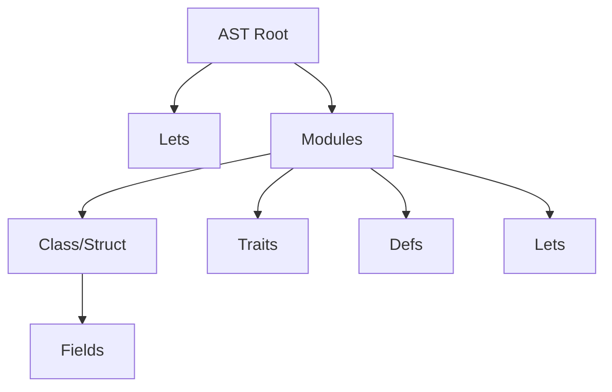
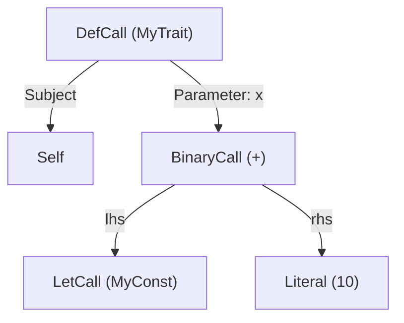

In the [previous post](/blog/creating-a-compiler-for-compost-using-rust-part-1-lexical-analysis/), I described how I implemented lexical analysis for Compost. 
The next phase in compilation is syntactic analysis, which turns the string of tokens into an 'abstract syntax tree'.
It also throws meaningful errors when wrong syntax is used.

# The Abstract Syntax Tree

An abstract syntax tree (AST) represents the code at the level of statements and expressions.
Every type of statement and expression has its own data structure, which can contain other statements or expressions, forming a tree of data structures.

The AST does not yet make meaningful links between different statements, this is left to the next stage of semantic analysis.
Instead, it just checks that the syntax of each individual statement and expression is correct.

## Statements

The tree of statements of the Compost programming language looks like this:

As you can see, it's not too complicated! A program has lets (functions and constants) and modules
A module can have a class or a struct, or neither.
A module can also have traits, defs (definitions of traits for that module), and lets (more functions and constants).
I might implement sub-modules in the future, but for now that hasn't been necessary.

## Expressions

Now let's look at expressions. Each `let` and `def` has an expression. 
Expressions represent operations performed on the data of the program to form a new value.
To give you an idea of what expressions can be: `1 + 1`, `.X + .Y` and `Function(a: ConstA, b: ConstB)` are all expressions.
In our Rust code, an `Expression` is defined as an enum:


pub enum Expression {
    // e.g. ... + ...
    Binary(BinaryCall),
    // e.g. MyFunction(a: ..., b: ...)
    Let(LetCall),
    // e.g. MyInstance.MyTrait(a: ..., b: ...)
    Def(DefCall),
    // e.g. 42
    Literal(RawValue),
    // e.g. myField
    Local(String),
    // e.g. myField.theirField
    FriendlyField(FriendlyField),
    // Self
    Zelf,
}

pub struct BinaryCall {
    // The operator.
    pub op: BinaryOp,
    // The left side of the operation, another expression.
    pub lhs: Box<Expression>,
    // The right side of the operation, another expression.
    pub rhs: Box<Expression>,
}

pub struct LetCall {
    // The name of the let being called.
    pub name: String,
    // The list of inputs, and their expressions.
    pub inputs: HashMap<String, Expression>,
}

pub struct DefCall {
    // The name of the trait being called.
    pub name: String,
    // The expression before the dot.
    pub subject: Box<Expression>,
    // The list of inputs and their expressions.
    pub inputs: HashMap<String, Expression>,
}

pub struct FriendlyField {
    pub local_name: String,
    pub field_name: String,
}


The full code can be found [here](https://github.com/sytzez/compost/blob/master/src/ast/expression.rs).

To demonstrate, the tree of the expression `Self.MyTrait(x: MyConst + 10)` will look like this:

## Types

Besides statements and expressions, we also have syntax for types. Types are due some improvement, so I'll skip the discussion for now. 
Currently a type can only be `Self`, the name of a trait or the name of a module.

# The 'Parser' Trait

Rust's traits provide a way to have uniform interfaces across different types.
This comes in handy for structuring our parsing logic.

I created a `Parser` trait that can be implemented on any type that can be parsed from `Tokens`.
It features a `matches` method, which checks if the upcoming token(s) match the type of statement that is being parsed,
and it features a `parse` method which takes the tokens and returns the parsed statement or an error if the syntax is incorrect.

The trait also provides a `maybe_parse` method which does both. It checks if the tokens match the statement and parses the statement if it does, or does nothing otherwise.
The `maybe_parse` method comes in handy when different types of statement can be expected.


pub trait Parser
where
    Self: Sized,
{
    /// Whether the upcoming tokens match this type of parser.
    fn matches(tokens: &[LeveledToken]) -> bool;

    /// Parse the tokens into a statement for the abstract syntax tree.
    fn parse(tokens: &mut Tokens) -> CResult<Self>;

    /// Parse tokens if they match this parser, otherwise do nothing.
    fn maybe_parse(tokens: &mut Tokens) -> CResult<Option<Self>> {
        if Self::matches(tokens.remaining()) {
            Ok(Some(Self::parse(tokens)?))
        } else {
            Ok(None)
        }
    }
}


Full source [here](https://github.com/sytzez/compost/blob/master/src/ast/parser.rs).

Using the `maybe_parse` method, we can parse multiple possibile statements using Rust's `if let` and `else if let` statements.
See how it's used inside the code for parsing a `mod` statement. Inside a `mod` we can expect `class`, `struct`, `traits` or `defs` statements.


/// The AST node for a module statement, which starts with 'mod'.
pub struct ModuleStatement {
    pub name: String,
    pub class: Option<ClassStatement>,
    pub strukt: Option<StructStatement>,
    pub traits: Vec<TraitStatement>,
    pub defs: Vec<DefStatement>,
    pub lets: Vec<LetStatement>,
}

impl Parser for ModuleStatement {
    /// If the next token is the keyword 'mod', we can expect this type of statement.
    fn matches(tokens: &[LeveledToken]) -> bool {
        matches!(tokens[0].0, Token::Kw(Kw::Mod))
    }

    /// The code that parses the next few tokens into a module statement.
    fn parse(tokens: &mut Tokens) -> CResult<Self> {
        // Check what the base level is, so we know when to exit the statement.
        let base_level = tokens.level();
        
        // Skip over the 'mod' keyword to the next token.
        tokens.step();

        // Parse the name of the module.
        let name = parse_global(tokens)?;

        // Create our AST node, to be filled with information from the coming tokens.
        let mut statement = ModuleStatement::new(name);

        // Keep looping for as long we're within the level of the module.
        while tokens.deeper_than(base_level) {
            // For each type of expected statement, check if the parser recognises it
            // and add the parsed statement to our module statement.
            if let Some(class) = ClassStatement::maybe_parse(tokens)? {
                statement.class = Some(class);
            } else if let Some(strukt) = StructStatement::maybe_parse(tokens)? {
                statement.strukt = Some(strukt);
            } else if let Some(mut traits) = TraitsStatement::maybe_parse(tokens)? {
                statement.traits.append(&mut traits.traits);
            } else if let Some(mut defs) = DefsStatement::maybe_parse(tokens)? {
                statement.defs.append(&mut defs.defs);
            } else if let Some(mut lets) = LetsStatement::maybe_parse(tokens)? {
                statement.lets.append(&mut lets.lets);
            } else {
                // Return an error if none of the expected statements match.
                return tokens.unexpected_token_error();
            }
        }

        Ok(statement)
    }
}


As you can see, using our Parser trait and the Tokens struct from the previous chapter, the code for parsing a statement becomes very clear and structured!
Before I did the `Parser` and `Tokens` refactors, this code was much lengthier and uglier. See the full code [here](https://github.com/sytzez/compost/blob/master/src/ast/module_statement.rs).

# Parsing Expressions

Parsing expressions is a bit harder, because there are so many possible types of expressions. You've seen the possibilities in the [chapter about Expressions](#expressions).
Luckily we can use `match` statements on our `Token` enum, to deal with every possible incoming token.


impl Parser for Expression {
    /// We can't really predict if a series of tokens is going to be an expression,
    /// it has to be determined from the context.
    fn matches(_tokens: &[LeveledToken]) -> bool {
        true
    }

    fn parse(tokens: &mut Tokens) -> CResult<Self> {
        // Check what the base level is for this expression.
        let base_level = tokens.level();

        // The first token needs cloning to prevent immutable borrow errors.
        let token = tokens.token().clone();

        // We parse the first token differently because there are different possibilities
        // than any following tokens. For example, a `.` at the beginning implies a trait
        // call on `Self`, while a `.` further on just means a trait call on whatever came
        // before it.
        let mut expr = match token {
            // The 'Self' keyword.
            Token::Kw(Kw::Zelf) => {
                // Step to the next token.
                tokens.step();

                Expression::Zelf
            }
            // ... more possibilities omitted here
            // The . operator at the beginning. Implies an operation on 'Self'.
            Token::Op(Op::Dot) => {
                // We don't step to the next token, so we can reevaluate the same dot in the next step.
                Expression::Zelf
            }
            // The - operator. Calls the Op\Neg trait on whatever comes after.
            Token::Op(Op::Sub) => {
                tokens.step();

                let expr = Expression::parse(tokens)?;

                Expression::Def(DefCall {
                    name: "Op\\Neg".to_string(),
                    subject: Box::new(expr),
                    inputs: [].into(),
                })
            }
            // Any other tokens cause a compiler error.
            _ => return tokens.unexpected_token_error(),
        };

        // Parse further operations, for as long as the tokens are on the level of this expression.
        while tokens.deeper_than_or_eq(base_level) {
            // Again, the token needs cloning to prevent immutable borrow errors.
            let token = tokens.token().clone();

            // Check what the next token is.
            expr = match token {
                Token::Op(op) => {
                    match op {
                        // Logic for dealing with binary operators.
                        Op::Add | Op::Sub | Op::Mul | Op::Div => {
                            tokens.step();

                            // Parse the tokens which come after it into an expression for the right hand side.
                            let rhs = Expression::parse(tokens)?;

                            Expression::Binary(BinaryCall {
                                op: match op {
                                    Op::Add => BinaryOp::Add,
                                    Op::Sub => BinaryOp::Sub,
                                    Op::Mul => BinaryOp::Mul,
                                    Op::Div => BinaryOp::Div,
                                    _ => unreachable!(),
                                },
                                // Put the expression as parsed so far into the left hand side.
                                lhs: Box::new(expr),
                                // Put the expression which comes afterwards into the right hand side
                                rhs: Box::new(rhs),
                            })
                        }
                        Op::Dot => {
                            // Omitted... Logic for dealing with Trait calls or FriendlyFields.
                        }
                        _ => return tokens.unexpected_token_error(),
                    }
                }
                _ => return tokens.unexpected_token_error(),
            }
        }

        Ok(expr)
    }
}


See the full file [here](https://github.com/sytzez/compost/blob/master/src/ast/expression.rs).

# Conclusion

Using the `Parser` trait, we've been able to parse tokens into an AST in a clean and structured manner.
Each type of statement has its own struct and its own implementation of `Parser` which parse the tokens into a node of the AST.

With a full AST, we have a complete representation of all statements and expressions in the code. 
However, the names in the code don't mean anything yet.
Whenever there is a call to a `let`, it's not connected to the definition of that `let` yet.

This 'meaning' of the code is analysed in the next step called semantic analysis.
You can read about it in [the next part of this series](/blog/creating-a-compiler-for-compost-using-rust-part-3-semantic-analysis/).

