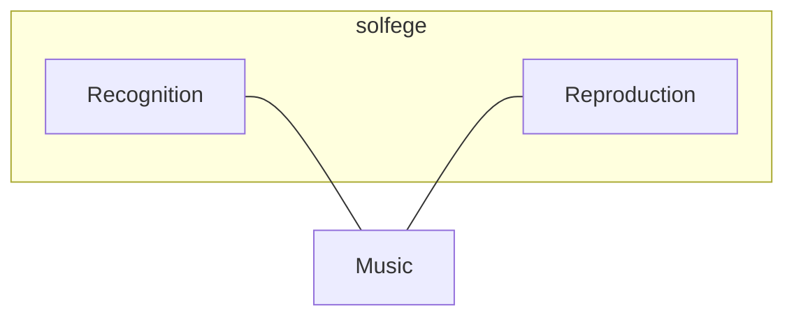
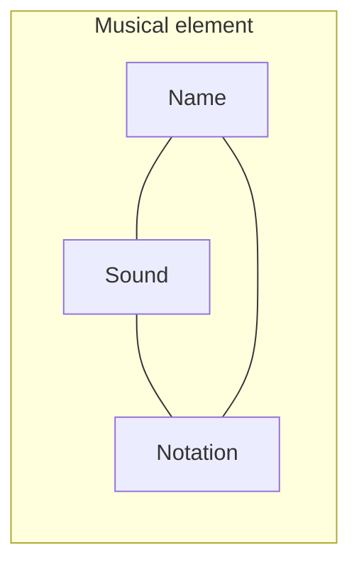
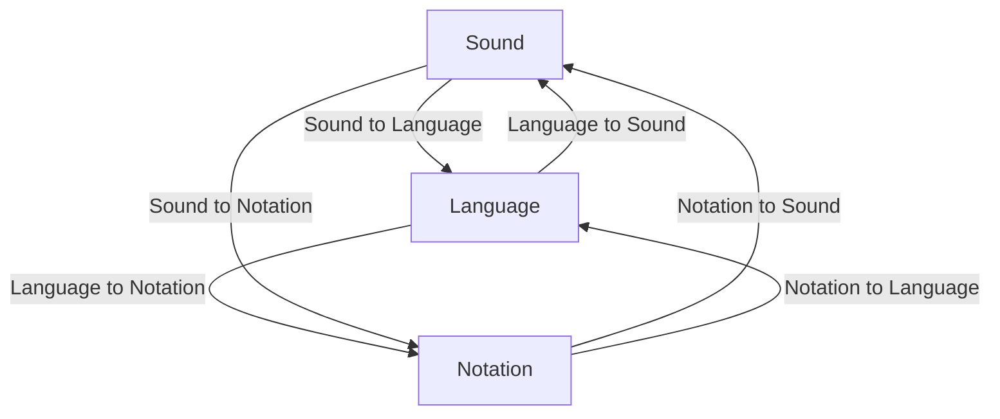

## The two skills of solfege

Solfege, in its fullest sense, is the art of translating musical ideas from one representation into another.
It teaches the skill of, on the one hand, *recognising* music in all its forms and, on the other hand, *reproducing* music in another form.

Music's primary medium is sound. Another common medium, especially before the invention of audio recording, is music notation, which is written using special musical symbols known as 'notes'.
Besides being represented by symbols, music can be described in written or spoken language.
The availability of musicological terminology can make verbal descriptions as precise or even preciser than musical notation.

With these three forms in mind, solfege teaches the ability of understanding each of those representations, as well as being able to accurately reproduce the same musical idea in another representation.

## The three representations

A musical element is the smallest building block of music such as a pitch, an interval or a note value.
Each musical element can be expressed in three different representations mentioned before.
If you can recognise and reproduce each representation, you have mastered the solfege of that specific musical element.
The three reperesentations of a musical element are: its sound, its name and its notation.

For example: the pitch C4 has an identifiable sound quality, a certain frequency.
While the timbre, dynamic or articulation of the sound might vary, the identifiable part is its frequency (assuming a certain tuning).
Regardless of the tuning, it has an identifiable quality in the context of other pitches in the same tuning: C4 is always a whole tone below D4.
Besides its sound quality, C4 also has a position on the musical staff, relative to the clef.
Its sound is its sound, its name is C4, its notation is the position on the staff.

Another example is the interval of a major third (M3). While the M3 doesn't have a specific pitch, its quality is identifiable when heard.
Each dyad of notes that is a major third apart has that sound quality. It is also recognisable in notation, by the vertical distance between two notes.

You could argue that a major third is not identifiable purely by its sound, because an augmented second (A2) has the same sound quality.
When the interval is isolated this is true, but in a broader musical context (assuming tonal harmony), there is a definite difference between a M3 and a A2,
related to the melodic outline it's used in, or the functional harmonic progression the chord with the interval is part of.
So it's possible to recognise a M3 or a A2 purely by listening. And that is definitely part of solfege.

The same three representation can be derived from rhythmic note values, chords, dynamics, articulation, tempo indications, tonalities, modulations, time signatures and other musical elements.

## The six modes

We've determined that solfege requires both recognising and reproducing musical representations.
We've also determined that there are three main representations of a musical element.

For each musical element, we can 'do' solfege in a number of different ways by varying the representation we recognise and the representation we reproduce.
Since there are three representations, there must be six (two times three) ways of doing solfege.
I'll call them modes of solfege.

To master the solfege of a musical element means to master each of these six modes:
Sound to language, language to notation, notation to sound, sound to notation, language to sound and notation to language.
Each of them can be practised separately.

To give example of one of these modes: 'sound to name' means listening to a sound and being able to call the element by its name, without using any notation.
'Notation to sound' means being able to read notes and hear in your head or physically reproduce the sound accurately.
With some imagination you can easily imagine the other modes.

Once you're able to succesfully perform each of these six modes for a specific musical element, the three representations will become a unified trinity in your mind.
You'll be able to understand and utilize the musical element to its full extent.

